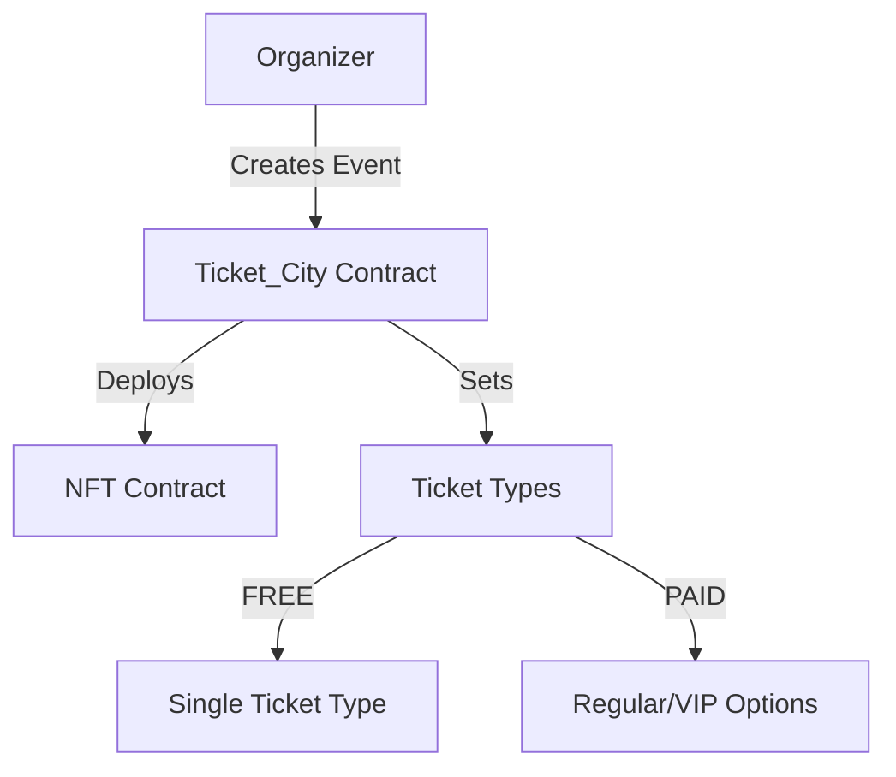
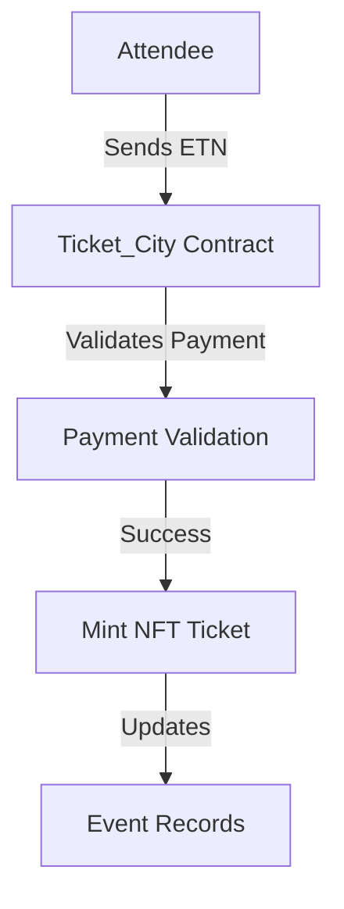

# Ticket City - Technical Documentation

'Ticket_City contract successfully deployed to': ''

## Smart Contract Architecture

### Core Components

1. `Ticket_City.sol`: Main contract handling event logic and ETN payments
2. `Ticket_NFT.sol`: Non-transferable NFT implementation for event tickets
3. `Types.sol`: Data structures and enums
4. `Errors.sol`: Custom error definitions

#### Security Measures

- NonReentrant guard for payment functions
- Event organizer verification
- Minimum attendance rate requirements
- Revenue release conditions

### Smart Contract Interactions

#### Event Creation Flow



#### Ticket Purchase Flow



#### Authentication Flow

- Web2-like auth flow during which an embedded evm wallet will be created for the users
- A web3 auth for guest users

### Key Features Implementations

- Event creation with flexible ticket types (FREE/PAID)
- Ticket categories: Regular and VIP for paid events
- Revenue management through ETN native token
- Attendance tracking and verification system
- Tickets issued as NFTs for security
- Automated ticket pricing based on demand (Future Implementation)
- Event discovery tools, including referral programs and discount codes (Future Implementation)
- Stablecoins payment (Future Implementation)

### Payments & Refunds

- Tickets purchased using ETN
- Organizers pay a small platform service fee (30 ETN) for paid events
- Ticket payments held safely until the event ends
- If an event is canceled, attendees get a refund plus a 2 ETN gas fee compensation from the organiser (Future Implementation)

### Revenue Management

- ETN payments held in contract
- 60% minimum attendance requirement
- Automated revenue release post-event
- Manual release option for owner

### Event Verification System

- Attendance tracked through QR codes or wallet authentication
- Attendee-controlled attendance marking
- Bulk verification support by an attendee that registered for others (Future Implementation)
- Attendance rate calculation
- Revenue release conditions

## Contract Constants

- `FREE_TICKET_PRICE`: 0 ETN
- `MINIMUM_ATTENDANCE_RATE`: 60%

## Error Handling

- Custom errors for gas optimization
- Comprehensive validation checks
- Secure payment processing

## Development Environment

### Prerequisites

- Node.js (v16 or higher)
- npm or yarn
- Git
- Alchemy API key for Electroneum Testnet access

### Project Setup

```bash
# Clone repository
git clone https://github.com/CityBlockLab/Ticket_City_Smart_Contract
cd Ticket_City_Smart_Contract

# Install dependencies
yarn

# Copy environment file
check hardhat config file...
```

## Development Workflow

### Common Commands

```bash
# Compile contracts
npx hardhat compile

# Clean artifacts
npx hardhat clean

# Run local node
npx hardhat node
```

## Contributing Guidelines

### Issue Management

1. **Creating Issues**

   - Use provided issue templates
   - Tag with appropriate labels
   - Include detailed description
   - Tag repository @devbigeazi

2. **Picking Issues**
   - Comment on the issue you want to work on
   - Wait for assignment
   - Tag repository @devbigeazi

### Branch Management

```bash
# Create new feature branch
git checkout -b feature/issue-number-description

# Create new bugfix branch
git checkout -b fix/issue-number-description

# Create new documentation branch
git checkout -b docs/issue-number-description
```

### Pull Request Process

1. **Before Submitting**

   - Run tests: `npx hardhat test`
   - Generate coverage: `npx hardhat coverage`
   - Update documentation if needed
   - Ensure clean compilation

2. **Submission Requirements**

   - Link related issue(s)
   - Provide detailed description
   - Include test results
   - Tag repository owner

3. **Review Process**
   - Address review comments
   - Update PR as needed
   - Maintain communication

### Code Standards

- Follow Solidity style guide
- Use NatSpec comments
- Implement proper error handling
- Maintain test coverage
- Follow gas optimization practices

## Security Considerations

1. **Access Control**

   - Implement role-based access
   - Use OpenZeppelin's Ownable where appropriate
   - Validate all inputs

2. **Payment Handling**

   - Use pull over push payments
   - Implement reentrancy guards
   - Handle edge cases

3. **Smart Contract Security**
   - Follow SCSVS guidelines
   - Implement emergency stops
   - Document assumptions
   - Consider gas limitations

## Support and Resources

- GitHub Issues: Technical problems and bug reports
- Telegram Community: General discussion and support
- Documentation: Comprehensive guides and references
- Security: Private disclosure process for vulnerabilities

For additional support or questions:

1. Check existing documentation
2. Search closed issues
3. Join Telegram community
4. Contact @devbigeazi


## All tests passed


